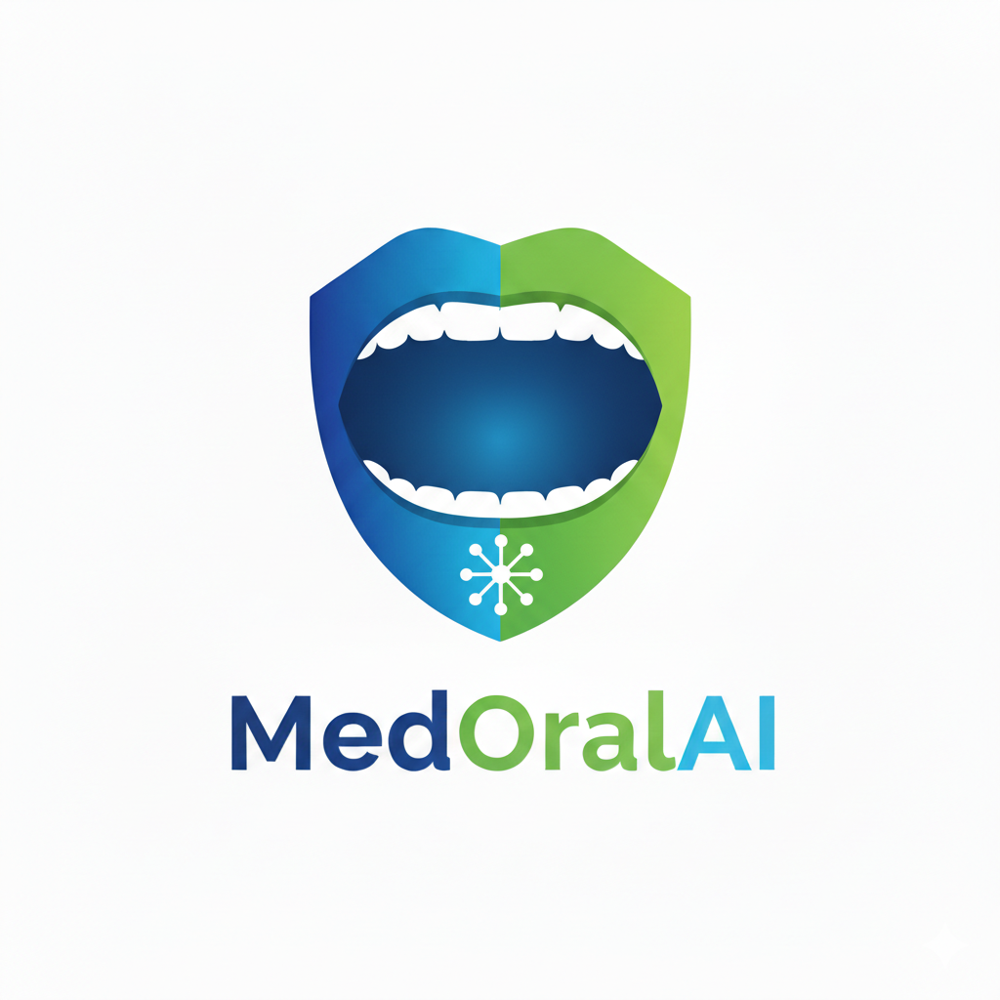

# MedOral AI - Early Detection System



> **Advanced Deep Learning System for Oral Lesion Analysis and Risk Assessment**

[](https://opensource.org/licenses/MIT)
[](https://www.python.org/)
[](https://reactjs.org/)
[](https://fastapi.tiangolo.com/)
[](https://tailwindcss.com/)

## 🏥 Overview

**MedOral AI** is a state-of-the-art medical imaging system designed to assist healthcare professionals in the early detection of oral cancer and suspicious lesions. By combining patient bio-data risk assessment with advanced computer vision (DenseNet201), the system provides a comprehensive "Second Opinion" analysis.

We prioritize **Explainable AI (XAI)**. Unlike "black box" models, MedOral AI generates **Grad-CAM heatmaps**, visually highlighting the specific regions of the tissue that triggered the AI's prediction. This builds trust and allows doctors to verify the AI's focus.

## ✨ Key Features

*   **Dual-Stream Analysis**: Combines clinical patient history (tobacco/alcohol use, symptoms) with image analysis.
*   **High-Performance AI**: Powered by a fine-tuned **DenseNet201** model trained on histopathological and clinical datasets.
*   **Explainability**: Integrated **Grad-CAM (Gradient-weighted Class Activation Mapping)** to visualize suspicious regions.
*   **Test-Time Augmentation (TTA)**: Performs multiple inference passes (e.g., flips, rotations) to ensure robust and stable predictions.
*   **Medical Reports**: Generates professional, downloadable **PDF Reports** in multiple languages (EN, ES, FR, HI).
*   **Modern UI**: Built with **React**, **TypeScript**, and **Shadcn UI** for a clean, accessible, and responsive clinical interface.

## 🛠️ Tech Stack

### Frontend
*   **Framework**: React (Vite)
*   **Language**: TypeScript
*   **Styling**: Tailwind CSS, Shadcn UI, Lucide Icons
*   **State Management**: React Hooks
*   **Animations**: Framer Motion

### Backend
*   **Framework**: FastAPI (Python)
*   **ML Engine**: TensorFlow / Keras
*   **Image Processing**: OpenCV, PIL, NumPy
*   **Report Generation**: ReportLab

## 🚀 Getting Started

### Prerequisites
*   Node.js (v16+)
*   Python (v3.9+)
*   Git

### Installation

1.  **Clone the repository**
    ```bash
    git clone https://github.com/hiburavt/medoral-ai.git
    cd medoral-ai
    ```

2.  **Setup Backend**
    ```bash
    # Create virtual environment
    python -m venv venv
    source venv/bin/activate  # On Windows: venv\Scripts\activate

    # Install dependencies
    pip install -r requirements.txt

    # Run the server
    python backend/app.py
    ```

3.  **Setup Frontend**
    ```bash
    cd frontend
    npm install
    npm run dev
    ```

4.  **Access the Application**
    *   Frontend: `http://localhost:5173`
    *   Backend API Docs: `http://localhost:8000/docs`

## 📖 Usage Guide

1.  **Assessment**: Fill out the patient risk questionnaire (Age, Habits, Symptoms).
2.  **Scan**: Upload a clear, well-lit image of the oral cavity or lesion.
3.  **Analysis**: The AI processes the image using TTA and generates a prediction with a confidence score.
4.  **Review**: Examine the AI Heatmap to see which areas are flagged.
5.  **Report**: Download the comprehensive PDF medical report for patient records.

## 🤝 Contributing

We welcome contributions from the open-source community! We believe that medical AI should be transparent and collaborative.

1.  Fork the Project
2.  Create your Feature Branch (`git checkout -b feature/AmazingFeature`)
3.  Commit your Changes (`git commit -m 'Add some AmazingFeature'`)
4.  Push to the Branch (`git push origin feature/AmazingFeature`)
5.  Open a Pull Request

**Note**: Please adhere to the Code of Conduct and ensure all medical data handling complies with HIPAA/GDPR standards (this repo contains no real patient data).

## 📄 License & Copyright

Distributed under the **MIT License**. See `LICENSE` for more information.

**Copyright © 2024 MedOral AI.**
*While this project is open-source, the "MedOral AI" branding, logo, and unique trained model weights are intellectual property of the authors. You are free to use the code, but please provide proper attribution.*

## ⚠️ Medical Disclaimer

**MedOral AI is a decision support tool, NOT a diagnostic device.**
It is designed to assist, not replace, qualified healthcare professionals. All predictions should be verified by a certified pathologist or oral surgeon. The authors assume no liability for medical decisions made based on this software.

---

*Made with ❤️ for a healthier world.*
